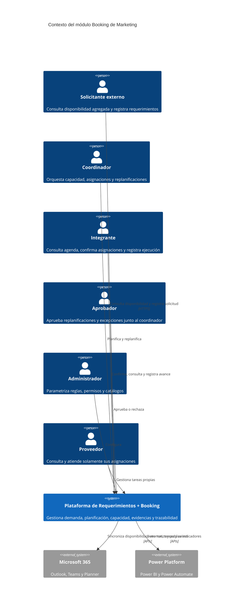
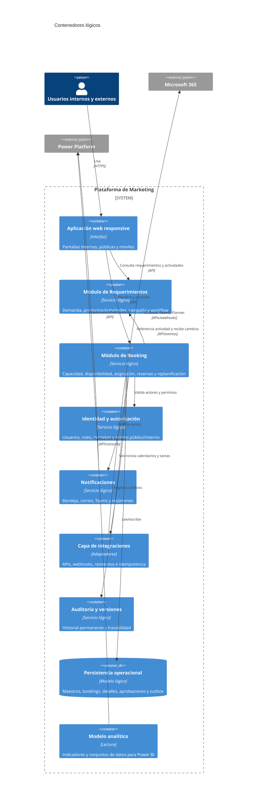
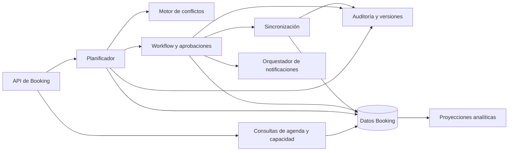
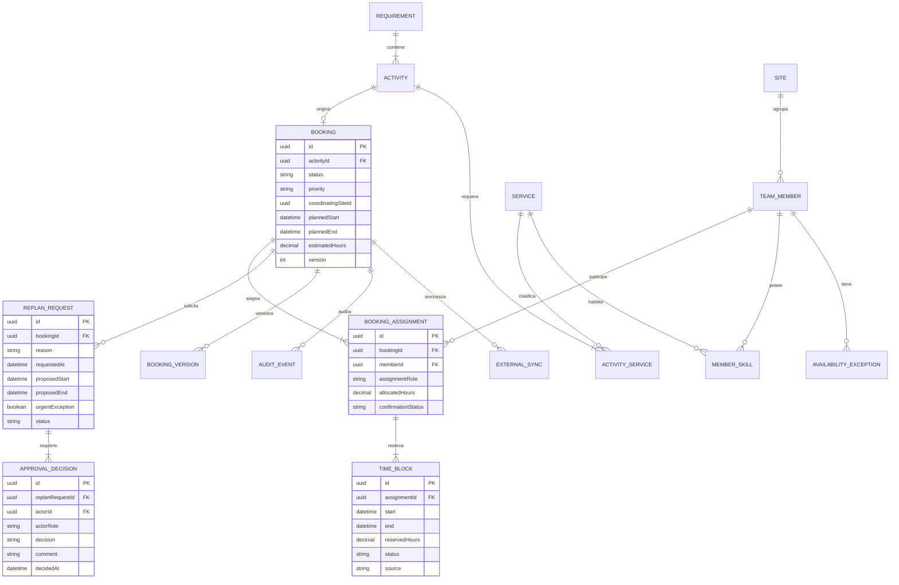
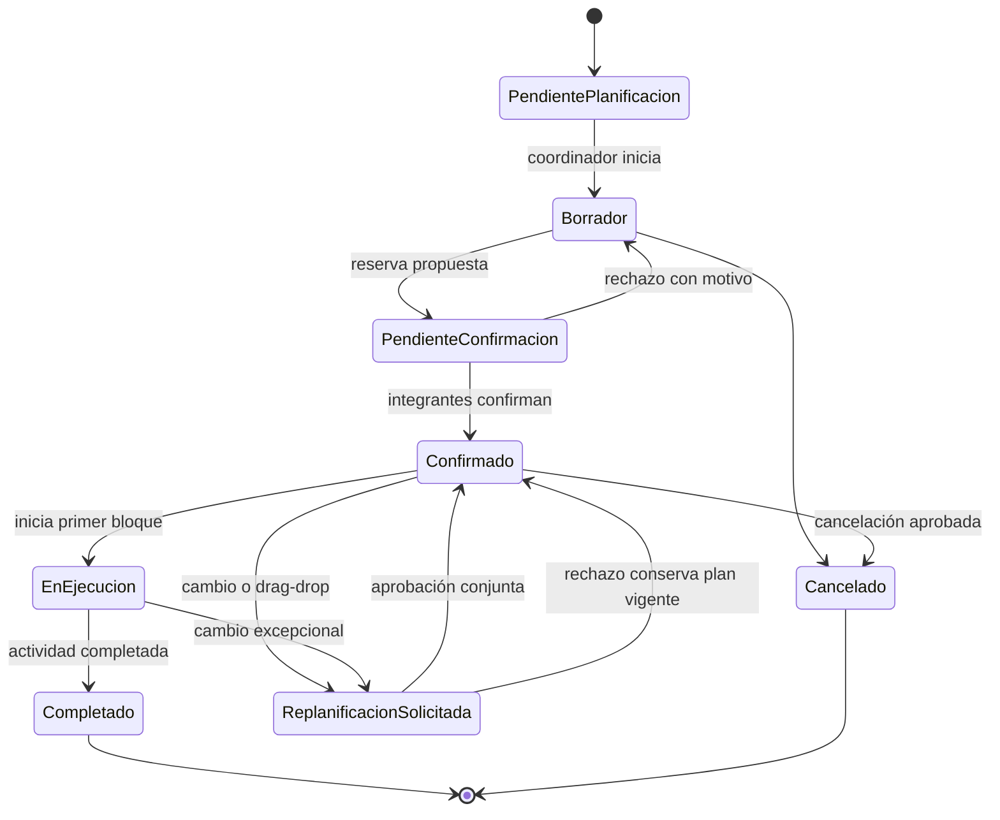
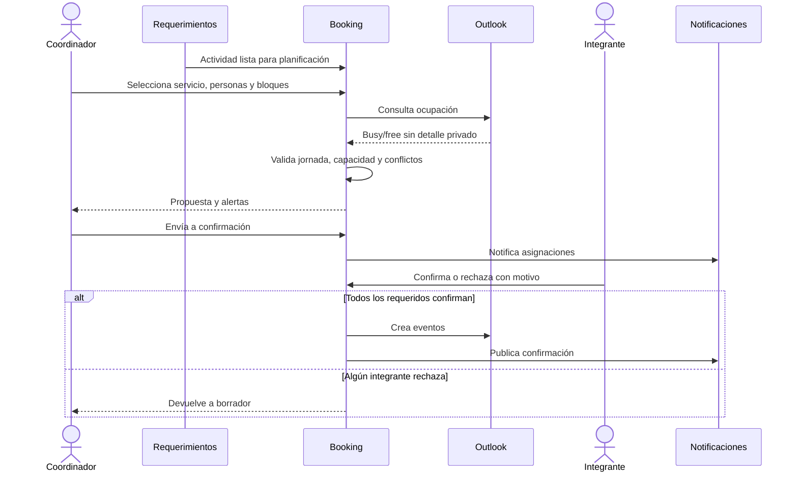
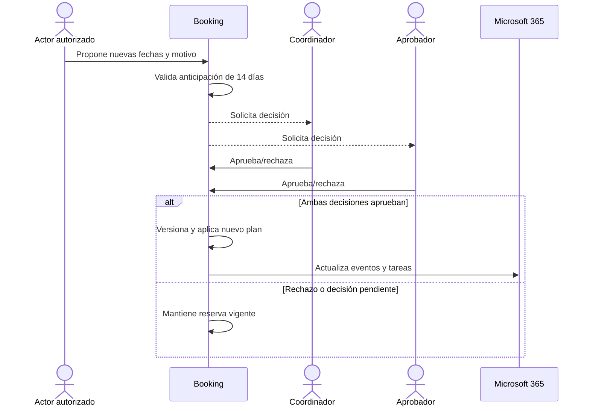
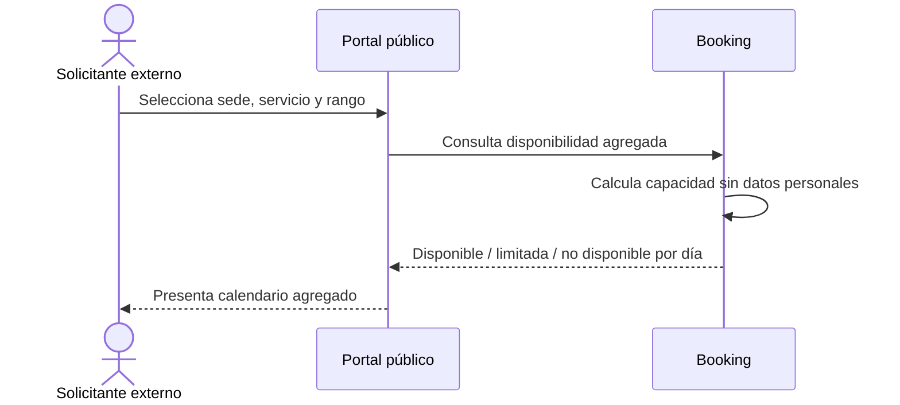

# Arquitectura del módulo de Booking para Marketing

**Estado:** Diseño funcional y lógico aprobado para pasar posteriormente a definición de stack  
**Sistema base:** Plataforma de Requerimientos de Marketing  
**Fecha:** 3 de julio de 2026  
**Zona horaria operativa:** America/Guayaquil

## 1. Propósito

Incorporar a la Plataforma de Requerimientos un módulo integrado de booking que permita visualizar disponibilidad, asignar trabajo, reservar horas y controlar la capacidad del equipo de Marketing. El módulo planifica el tiempo de 18 integrantes, distribuidos en tres sedes, para servicios como diseño, video, fotografía, redes y eventos.

El booking no sustituye al requerimiento ni a sus productos/actividades. El requerimiento conserva el contexto de negocio y cada producto/actividad genera la necesidad de planificación. El módulo de Booking administra quién realizará el trabajo, en qué bloques horarios y con qué capacidad.

## 2. Alcance validado

### 2.1 Incluido

- Todo booking nace de un requerimiento y de uno de sus productos/actividades.
- Responsable principal y múltiples colaboradores por actividad.
- Uno o varios bloques horarios individuales por integrante.
- Calendarios diario, semanal y mensual.
- Agenda, Kanban, línea de tiempo, carga por persona y vista “Mi agenda”.
- Reprogramación visual mediante arrastrar y soltar.
- Filtros por persona, rol, sede, campaña, estado, prioridad y servicio.
- Jornada de lunes a viernes, de 08:30 a 17:30.
- Ocho horas laborables diarias; la hora de almuerzo se parametriza individualmente dentro de la franja 13:00–15:00.
- Bloqueo por reuniones, vacaciones, permisos, feriados y ausencias.
- Integración mediante APIs con Outlook, Teams, Planner, Power BI y Power Automate.
- Acceso interno y acceso público controlado.
- Experiencia prioritaria para dispositivos móviles.
- Auditoría y versionado permanentes.
- Notificaciones en plataforma, correo y Teams.
- Resúmenes diarios y semanales para el coordinador.
- Aproximadamente 40 requerimientos/bookings mensuales.

### 2.2 Fuera del MVP

- Reserva de cámaras, estudios, salas, vehículos u otros activos físicos.
- Optimización automática avanzada mediante inteligencia artificial.
- Facturación de proveedores.
- Sustitución de Outlook o Planner como herramientas corporativas.

## 3. Principios arquitectónicos

1. **Módulo integrado:** Booking reutiliza identidad, usuarios, roles, sedes, campañas, catálogos, auditoría y notificaciones de la plataforma existente.
2. **Separación de responsabilidades:** Requerimientos administra la demanda; Booking administra capacidad y tiempo.
3. **Una fuente de verdad por dato:** la actividad pertenece a Requerimientos; el bloque reservado pertenece a Booking; la ocupación externa proviene de Outlook.
4. **Cambios controlados:** una modificación del requerimiento no altera silenciosamente una reserva confirmada.
5. **Privacidad por diseño:** los externos solo reciben disponibilidad agregada por sede, servicio y día.
6. **API-first:** las integraciones y capacidades del módulo se exponen mediante contratos versionados.
7. **Auditoría inmutable:** toda asignación, aprobación, excepción y replanificación conserva actor, fecha, origen, motivo y valores anteriores/posteriores.
8. **Parametrización antes que código:** visibilidad, horarios, anticipación, estados, prioridades, servicios, reglas y notificaciones serán configurables.

## 4. Contexto C4 — Nivel 1



## 5. Contenedores lógicos C4 — Nivel 2

Este nivel define responsabilidades, no productos ni tecnologías.



## 6. Componentes del módulo Booking — C4 Nivel 3



### Responsabilidades

| Componente | Responsabilidad |
|---|---|
| API de Booking | Contratos internos/públicos, validación de entrada y control de acceso. |
| Consultas | Calendario, agenda, tablero, línea de tiempo, carga y disponibilidad agregada. |
| Planificador | Crea bookings, asigna personas y divide trabajo en bloques. |
| Motor de conflictos | Evalúa solapamientos, jornada, almuerzo, ausencias, Outlook, capacidad y sede. |
| Workflow | Confirmación, aprobación conjunta, replanificación, urgencia, rechazo y cancelación. |
| Sincronización | Outlook, Teams, Planner y eventos provenientes de Requerimientos. |
| Notificaciones | Avisos transaccionales, recordatorios, atrasos y resúmenes. |
| Auditoría | Historial permanente y versiones recuperables para consulta. |
| Proyecciones | Datos optimizados para paneles operativos y Power BI. |

## 7. Modelo de dominio maestro–detalle



### 7.1 Maestros parametrizables

- Sede.
- Servicio de marketing.
- Habilidad por integrante y nivel.
- Jornada y franjas de almuerzo.
- Calendario laboral y feriados.
- Estado de booking, asignación y replanificación.
- Prioridad y reglas de urgencia.
- Anticipación mínima, inicialmente 14 días.
- Plantillas y canales de notificación.
- Políticas de visibilidad por perfil, pantalla, campo y sede.
- Motivos de rechazo, cancelación, ausencia y replanificación.
- Reglas de resumen diario/semanal.

### 7.2 Maestro Booking y tablas detalle

La pantalla principal seguirá el patrón visual de la Plataforma de Requerimientos:

- **Cabecera/maestro:** requerimiento, actividad, campaña, sede coordinadora, servicios, prioridad, estado, fechas objetivo, horas estimadas y coordinador.
- **Detalle de responsables:** integrante, sede, función principal/colaborador, horas asignadas, confirmación y estado.
- **Detalle de bloques:** fecha, hora inicial/final, duración, origen, conflicto y sincronización externa.
- **Detalle de aprobaciones:** tipo, actor requerido, decisión, comentario y fecha.
- **Detalle de historial:** versión, cambio, autor, canal, motivo y valores antes/después.
- **Detalle de integraciones:** sistema externo, identificador, estado, último intento y error saneado.

Los detalles se presentarán como grids/tablas responsivas; en móvil se transformarán en tarjetas expandibles sin perder acciones ni contexto.

## 8. Estados y reglas

### 8.1 Booking



### 8.2 Reglas invariantes

1. No existe booking sin actividad válida y activa.
2. Un booking debe tener al menos un servicio, un responsable principal y un bloque.
3. Cada integrante recibe bloques independientes aunque comparta actividad.
4. Un bloque confirmado descuenta capacidad y bloquea el horario.
5. Los bloques no atraviesan jornada, almuerzo o ausencias, salvo excepción aprobada.
6. El sistema impide solapamientos; la excepción requiere flujo explícito.
7. Una replanificación normal debe solicitarse con al menos 14 días de anticipación.
8. Una urgencia fuera de plazo exige motivo y aprobación conjunta de coordinador y aprobador.
9. La aprobación conjunta requiere dos decisiones afirmativas de actores habilitados; un rechazo detiene el cambio.
10. Mientras se aprueba una replanificación, la reserva vigente continúa bloqueando capacidad.
11. Los cambios recibidos desde Requerimientos crean una alerta o solicitud; no sobrescriben reservas confirmadas.
12. Cancelar o eliminar lógicamente una actividad inicia cancelación del booking y conserva historial.
13. Una operación repetida con la misma clave de idempotencia no crea duplicados.
14. Las sincronizaciones externas no exponen el contenido de eventos privados.

## 9. Flujos principales

### 9.1 Planificación inicial



### 9.2 Replanificación



### 9.3 Consulta pública



## 10. Contratos de integración

Los siguientes contratos son conceptuales. Sus formatos concretos se definirán con el stack.

### 10.1 Requerimientos → Booking

**Evento `ActivityReadyForPlanning.v1`**

```json
{
  "eventId": "uuid",
  "occurredAt": "ISO-8601",
  "activityId": "uuid",
  "requirementId": "uuid",
  "campaignId": "uuid|null",
  "requestingSiteId": "uuid",
  "serviceIds": ["uuid"],
  "priority": "Normal|High|Urgent",
  "desiredDeliveryDate": "ISO-8601",
  "estimatedHours": 16,
  "activityVersion": 4
}
```

**Evento `ActivityChanged.v1`:** incluye campos modificados, versión anterior/nueva y si el cambio afecta responsables, servicios, prioridad o fechas. Booking responde creando una alerta o solicitud de replanificación.

### 10.2 Booking → Requerimientos

**Evento `BookingStatusChanged.v1`:** informa estado de planificación, responsables, rango planificado, horas reservadas y versión. Requerimientos lo muestra como seguimiento, sin apropiarse de los bloques.

### 10.3 API interna de Booking

| Operación lógica | Propósito |
|---|---|
| `POST /bookings` | Crear borrador desde una actividad. |
| `GET /bookings/{id}` | Obtener maestro, detalles y versión. |
| `PUT /bookings/{id}` | Editar borrador con control de concurrencia. |
| `POST /bookings/{id}/assignments` | Agregar responsable o colaborador. |
| `POST /assignments/{id}/blocks` | Reservar un bloque individual. |
| `POST /bookings/{id}/submit` | Enviar a confirmación. |
| `POST /assignments/{id}/confirm` | Confirmar o rechazar asignación. |
| `POST /bookings/{id}/replan-requests` | Proponer replanificación. |
| `POST /replan-requests/{id}/decisions` | Registrar decisión de coordinador/aprobador. |
| `GET /availability` | Consultar capacidad interna detallada. |
| `GET /calendar` | Proyección diaria/semanal/mensual. |
| `GET /workload` | Carga por persona, sede, servicio y periodo. |
| `GET /my-agenda` | Agenda del usuario autenticado. |

Toda escritura usa identificador de idempotencia y versión esperada para impedir duplicados y pérdida de cambios concurrentes.

### 10.4 API pública

`GET /public/availability?siteId=&serviceId=&from=&to=` devuelve únicamente:

```json
{
  "siteId": "uuid",
  "serviceId": "uuid",
  "days": [
    { "date": "2026-07-06", "availability": "Available" },
    { "date": "2026-07-07", "availability": "Limited" }
  ]
}
```

No devuelve usuarios, eventos, porcentajes individuales ni horarios personales. Sus campos, rangos consultables y umbrales se parametrizan.

### 10.5 Microsoft 365

- **Outlook:** consulta busy/free; crea, actualiza y cancela eventos confirmados; conserva identificador externo y versión.
- **Teams:** entrega avisos, confirmaciones y enlaces profundos hacia el booking.
- **Planner:** crea/actualiza una tarea operativa por asignación o por booking, según parametrización; Booking continúa siendo la fuente de verdad de las reservas.
- **Webhooks:** reciben cambios y disparan reconciliación, sin aplicar modificaciones destructivas automáticamente.
- **Fallas:** reintento con espera incremental, registro de error, cola de pendientes y reconciliación manual.

### 10.6 Power Platform

- **Power Automate:** recordatorios, escalamiento, avisos de atraso y resúmenes diarios/semanales.
- **Power BI:** lectura de una proyección analítica estable, sin consultar tablas transaccionales internas directamente.

## 11. Matriz de permisos

Leyenda: **T** total, **P** propio/limitado, **A** agregado, **—** no permitido.

| Capacidad | Administrador | Coordinador | Integrante | Solicitante | Aprobador | Proveedor | Externo público |
|---|:---:|:---:|:---:|:---:|:---:|:---:|:---:|
| Configurar catálogos/reglas | T | P | — | — | — | — | — |
| Ver calendario del equipo | T | T | P | — | P | — | — |
| Ver disponibilidad agregada | T | T | T | A | A | A | A |
| Crear booking desde actividad | T | T | — | — | — | — | — |
| Asignar/reasignar personas | T | T | — | — | — | — | — |
| Confirmar asignación | — | P | P | — | — | P | — |
| Solicitar replanificación | T | T | P | P | P | P | — |
| Aprobar replanificación | — | T | — | — | T | — | — |
| Autorizar urgencia/excepción | — | T* | — | — | T* | — | — |
| Registrar horas reales | P | T | P | — | — | P | — |
| Ver auditoría | T | T | P | P | P | P | — |
| Consultar indicadores | T | T | P | P | T | P | — |

`*` Requiere aprobación conjunta. La visibilidad exacta por pantalla, campo, sede y estado será parametrizable.

## 12. Pantallas propuestas

1. **Dashboard de Booking:** capacidad, conflictos, pendientes, atrasos y próximos hitos.
2. **Calendario del equipo:** día/semana/mes, drag-and-drop y filtros.
3. **Planificador maestro–detalle:** cabecera del booking y grids de responsables, bloques, aprobaciones e historial.
4. **Mi agenda:** bloques propios, confirmaciones, registro de horas y cambios.
5. **Carga del equipo:** horas disponibles/reservadas por persona, sede y servicio.
6. **Kanban:** bookings por estado y prioridad.
7. **Línea de tiempo:** actividad, responsables, bloques y fecha de entrega.
8. **Replanificaciones:** solicitudes, comparación antes/después y doble aprobación.
9. **Disponibilidad pública:** calendario agregado por sede y servicio.
10. **Parametrización:** horarios, almuerzos, feriados, servicios, habilidades, visibilidad, reglas y notificaciones.
11. **Auditoría/versiones:** comparación de versiones y trazabilidad de integraciones.

Las pantallas reutilizarán navegación, encabezados, formularios, tablas, filtros, paginación, estados visuales, mensajes y comportamiento responsive del proyecto “Plataforma de Requerimientos”.

## 13. Requisitos no funcionales

- **Seguridad:** autenticación interna robusta; acceso público limitado, protegido contra abuso y sin datos personales.
- **Autorización:** permisos por rol, usuario, sede, pantalla, acción y campo.
- **Privacidad:** busy/free sin contenido privado; minimización de datos en APIs públicas.
- **Concurrencia:** versión optimista para edición y replanificación.
- **Consistencia:** transacción local y publicación confiable de eventos mediante patrón outbox.
- **Resiliencia:** reintentos, idempotencia, circuitos de protección y reconciliación de integraciones.
- **Observabilidad:** logs correlacionados, métricas, trazas, estado de sincronización y alertas operativas.
- **Rendimiento:** calendarios y carga deben usar proyecciones de lectura y consultas paginadas.
- **Accesibilidad:** navegación por teclado, contraste, etiquetas y adaptación móvil.
- **Internet:** exposición protegida, cifrada y separada entre rutas públicas e internas.
- **Tiempo:** almacenamiento consistente y presentación en America/Guayaquil.
- **Auditoría:** conservación permanente según decisión institucional, con acceso restringido y respaldo.

## 14. Indicadores

- Capacidad teórica, disponible, reservada y ejecutada.
- Porcentaje de ocupación por persona, sede, servicio y periodo.
- Sobreasignaciones intentadas y excepciones aprobadas.
- Cumplimiento de fechas y bloques.
- Retraso medio y cantidad de tareas atrasadas.
- Horas estimadas frente a reservadas y reales.
- Tiempo invertido por tipo de servicio/campaña.
- Tiempo hasta primera planificación y hasta confirmación.
- Número y motivo de replanificaciones.
- Productividad contextual, evitando comparar personas únicamente por volumen.
- Salud de sincronizaciones con Outlook, Teams y Planner.

## 15. Decisiones arquitectónicas

### ADR-001 — Booking como módulo integrado

Se incorpora al sistema actual y reutiliza sus capacidades transversales. Evita duplicar usuarios, roles, sedes y auditoría, manteniendo límites internos claros.

### ADR-002 — Actividad como origen obligatorio

No se permiten bookings huérfanos. Esto preserva trazabilidad entre demanda, ejecución, evidencia y aprobación.

### ADR-003 — Reserva individual por bloques

Una actividad compartida produce asignaciones individuales y cada asignación contiene bloques. Permite medir capacidad real y evitar que un único rango represente incorrectamente a todo el equipo.

### ADR-004 — Replanificación en lugar de sobrescritura

Los cambios posteriores a la confirmación crean una propuesta versionada. El plan vigente continúa activo hasta la aprobación conjunta.

### ADR-005 — Integraciones desacopladas

Microsoft 365 y Power Platform se conectan mediante una capa de adaptadores y eventos confiables. Un fallo externo no revierte la planificación interna ya confirmada; queda pendiente de reconciliación.

### ADR-006 — Disponibilidad pública agregada

El portal público expone solamente estados diarios por sede y servicio. Protege privacidad y reduce riesgo de inferencia sobre agendas individuales.

### ADR-007 — Parametrización de visibilidad

La información visible se controla por perfil, pantalla, campo, sede y contexto público/interno. Permite evolucionar políticas sin rediseñar pantallas.

### ADR-008 — Recursos físicos fuera del MVP

El modelo inicial se enfoca en personas y servicios. Puede ampliarse después con un agregado de recursos reservables sin alterar el núcleo de asignaciones individuales.

## 16. Plan de implementación por fases

### Fase 0 — Preparación

- Confirmar catálogos de servicios, campañas, sedes, personas y habilidades.
- Depurar usuarios y roles del sistema existente.
- Acordar reglas de calendario, feriados, almuerzo y permisos.
- Definir credenciales y gobierno de APIs corporativas.
- Preparar datos de prueba y criterios de aceptación.

### Fase 1 — MVP útil y manejable

- Integración obligatoria actividad → booking.
- Maestro–detalle de booking, responsables y bloques.
- Calendarios diario/semanal/mensual.
- “Mi agenda”, carga por persona y filtros esenciales.
- Validación de jornada, almuerzo, ausencias y conflictos.
- Confirmación/rechazo del integrante.
- Replanificación con 14 días y aprobación conjunta.
- Auditoría/versiones permanentes.
- Notificaciones en plataforma y correo.
- Responsive móvil.
- Disponibilidad pública agregada y parametrizable.
- Indicadores operativos básicos: capacidad, ocupación, retraso y cumplimiento.

### Fase 2 — Integración Microsoft 365

- Sincronización bidireccional busy/free y eventos de Outlook.
- Notificaciones y acciones en Teams.
- Creación/actualización de tareas en Planner.
- Reconciliación, reintentos y panel de salud de integraciones.
- Resúmenes diarios y semanales mediante automatización.

### Fase 3 — Analítica y optimización

- Modelo analítico completo para Power BI.
- Horas estimadas/reservadas/reales y productividad contextual.
- Recomendación de personas y franjas según habilidades/capacidad.
- Pronóstico de demanda y alertas de saturación.
- Evaluación posterior de recursos físicos reservables.

## 17. Criterios de éxito del MVP

1. El coordinador puede convertir una actividad en una planificación completa sin duplicar datos.
2. Cada hora confirmada descuenta capacidad del integrante correcto.
3. El sistema detecta solapamientos y bloqueos laborales antes de confirmar.
4. Los integrantes pueden revisar y confirmar desde un teléfono.
5. Una replanificación no altera el plan vigente sin las dos aprobaciones.
6. Los externos consultan disponibilidad útil sin acceder a datos personales.
7. Todo cambio puede reconstruirse desde auditoría y versiones.
8. Coordinación puede identificar ocupación, capacidad futura, sobrecarga y atrasos.
9. El patrón visual y operativo resulta coherente con la Plataforma de Requerimientos.

## 18. Pendientes para el siguiente paso

La arquitectura no selecciona todavía lenguajes, frameworks, bases de datos, mensajería, componentes de calendario ni infraestructura. El siguiente paso será evaluar el stack tecnológico contra este diseño, el stack ya utilizado por la Plataforma de Requerimientos, las APIs corporativas y las restricciones de despliegue.
