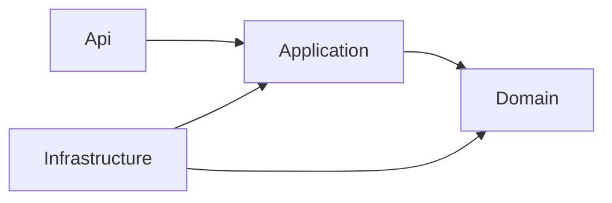

# Stack tecnológico y estructura del backend

**Estado:** Aprobado  
**Fecha:** 3 de julio de 2026

## 1. Stack adoptado

| Área | Decisión |
|---|---|
| Backend | .NET 10, ASP.NET Core Web API con controladores y EF Core 10. |
| Arquitectura | Monolito modular con Clean Architecture en un único proyecto backend. |
| Datos | Una base `AgendamientoMKT` y un `DbContext`, alojados en la instancia SQL Server 2022 ya utilizada por la Plataforma de Requerimientos. |
| Frontend | Next.js, React y TypeScript. |
| Integraciones | Microsoft Graph para Outlook, Teams y Planner; Power Platform para Power BI y Power Automate. |
| Desarrollo local | Docker Compose con SQL Server. |
| Exposición | Nginx como reverse proxy en ambientes desplegados. |

## 2. Decisión de arquitectura

El backend será un único ejecutable y un único archivo de proyecto (`AgendamientoMKT.Api.csproj`). La separación se realizará mediante carpetas, namespaces, interfaces y reglas de dependencia; no mediante múltiples microservicios o múltiples bases de datos.

```text
src/AgendamientoMKT.Api/
├── Api/
│   ├── Controllers/
│   ├── Contracts/
│   ├── Filters/
│   └── Middleware/
├── Application/
│   ├── Abstractions/
│   ├── Bookings/
│   ├── Availability/
│   ├── Replanning/
│   ├── Approvals/
│   └── Notifications/
├── Domain/
│   ├── Bookings/
│   ├── Team/
│   ├── Catalogs/
│   ├── Audit/
│   └── Shared/
├── Infrastructure/
│   ├── Persistence/
│   ├── Repositories/
│   ├── MicrosoftGraph/
│   ├── PowerPlatform/
│   └── BackgroundJobs/
├── Configuration/
└── Program.cs
```

## 3. Reglas de dependencia



- `Domain` no depende de ASP.NET Core, EF Core, SQL Server ni servicios externos.
- `Application` coordina casos de uso y depende de abstracciones y del dominio.
- `Infrastructure` implementa repositorios, persistencia e integraciones.
- `Api` recibe solicitudes, aplica autenticación/autorización y delega al caso de uso.
- Las dependencias se registran en el punto de composición de la aplicación.

## 4. Controladores delgados

Un controlador puede:

- Recibir y validar el contrato HTTP.
- Obtener la identidad y contexto autorizado.
- Invocar un servicio/caso de uso de Application.
- Convertir el resultado en una respuesta HTTP.

Un controlador no puede:

- Consultar directamente el `DbContext`.
- Implementar reglas de disponibilidad, conflictos o aprobación.
- Administrar transacciones.
- Invocar directamente Microsoft Graph o Power Platform.
- Construir consultas SQL o manipular entidades para ejecutar el workflow.

## 5. Servicios y casos de uso

Cada endpoint delegará en una clase de Application con una responsabilidad concreta, por ejemplo:

- `CreateBookingService`.
- `AssignTeamMemberService`.
- `ReserveTimeBlockService`.
- `ConfirmAssignmentService`.
- `RequestReplanningService`.
- `DecideReplanningService`.
- `GetAvailabilityService`.

Las reglas esenciales también vivirán dentro de entidades, agregados y servicios de dominio cuando no pertenezcan a una sola entidad.

## 6. Patrón Repository

Se utilizarán repositorios específicos por agregado:

```text
IBookingRepository
ITeamMemberRepository
IAvailabilityRepository
IReplanningRepository
IAuditRepository
```

Reglas:

- Las interfaces se definen en Application o Domain según su uso.
- Las implementaciones con EF Core residen en Infrastructure.
- No se expondrá `DbSet`, `IQueryable` ni tipos de EF Core fuera de Infrastructure.
- No se creará un repositorio genérico que convierta toda la aplicación en CRUD indiferenciado.
- El `DbContext` funcionará como unidad de trabajo para una transacción local.
- Las consultas complejas de lectura podrán usar servicios de consulta dedicados sin romper el modelo de escritura.

## 7. Una sola base de datos

La base se denomina `AgendamientoMKT`. Es la única base utilizada por el backend de Booking, pero comparte la instancia `requirements-sqlserver` con las bases de la Plataforma de Requerimientos. Se organizará por esquemas lógicos:

| Esquema | Responsabilidad |
|---|---|
| `booking` | Bookings, asignaciones, bloques y replanificaciones. |
| `identity` | Usuarios, roles y permisos si se alojan localmente. |
| `catalog` | Sedes, servicios, prioridades y parametrizaciones. |
| `integration` | Outbox, inbox, suscripciones y sincronizaciones. |
| `audit` | Auditoría funcional y metadatos de versiones. |

Se aplicará una única secuencia de migraciones de EF Core. Las tablas críticas de booking utilizarán historial temporal, además de auditoría funcional con actor y motivo.

## 8. Transacciones e integraciones

- Una operación de negocio confirma sus cambios y el evento Outbox en la misma transacción SQL.
- Un proceso en segundo plano publica o procesa integraciones.
- Microsoft Graph y Power Platform nunca participan dentro de la transacción de base de datos.
- Todos los comandos externos usan idempotencia, reintentos y trazabilidad.
- Los fallos externos quedan pendientes de reconciliación y no corrompen el booking confirmado.

## 9. Docker Compose local

El archivo raíz `docker-compose.yml` reutiliza el contenedor `requirements-sqlserver` y la red externa `requirements-platform_default`. Ejecuta un inicializador idempotente que crea la base `AgendamientoMKT` dentro de esa instancia si todavía no existe.

No inicia un segundo motor SQL Server ni crea otro volumen de datos. La persistencia continúa bajo el Compose de la Plataforma de Requerimientos.

Cuando existan backend y frontend, se incorporarán al mismo Compose junto con Nginx, sin guardar secretos en el repositorio.

### Inicio

```powershell
Copy-Item .env.example .env
docker compose run --rm sqlserver-init
```

La contraseña de `.env.example` es únicamente ilustrativa y debe reemplazarse en `.env`.

El contenedor inicializador termina después de verificar o crear la base. El ciclo de vida del SQL Server compartido se administra desde el proyecto `requirements-platform`.

## 10. Decisiones que permanecen pendientes

- Componente concreto de calendario y su licencia.
- Estrategia final de identidad para solicitantes externos.
- Infraestructura de producción y certificados.
- Permisos exactos de Microsoft Graph y consentimiento institucional.
- Versiones exactas de Next.js y librerías UI al iniciar el frontend.
