# Manual funcional — AgendamientoMKT

**Versión:** MVP rama `dev`  
**Fecha:** 3 de julio de 2026  
**Audiencia:** Marketing, coordinación, aprobadores, administradores, integrantes, QA y capacitación

## 1. Propósito

AgendamientoMKT centraliza la disponibilidad, asignación de trabajo y reserva de horas del equipo de Marketing. Cada booking se relaciona con un requerimiento y una actividad de la Plataforma de Requerimientos; dentro del booking se definen responsables, colaboradores y bloques de tiempo.

El sistema también administra:

- Usuarios y roles.
- Permisos de acceso.
- Pantallas y menú.
- Sedes y servicios.
- Horarios y reglas.
- Auditoría.
- Métricas de uso.
- Configuración futura de Microsoft 365 y Power Platform.

## 2. Alcance del MVP

### Disponible

- Iniciar sesión.
- Visualizar dashboard.
- Consultar y crear bookings.
- Asignar responsables/colaboradores mediante API.
- Agregar bloques horarios mediante API.
- Enviar booking a confirmación.
- Confirmar/rechazar asignación mediante API.
- Consultar agenda visual.
- Crear usuarios.
- Consultar roles, permisos, sedes, servicios, pantallas y menú.
- Editar parámetros generales.
- Consultar auditoría y métricas.

### Pendiente

- Sincronización real con Outlook, Teams y Planner.
- Automatizaciones reales de Power Automate.
- Dataset Power BI.
- Replanificación completa con doble aprobación.
- Drag-and-drop persistente.
- Registro real de horas trabajadas.
- Disponibilidad pública calculada desde bookings y Outlook.

## 3. Organización y perfiles

El modelo considera 18 integrantes, seis por cada una de tres sedes. Los servicios iniciales son Diseño, Video, Fotografía, Redes y Eventos.

### 3.1 Roles

| Rol | Responsabilidad funcional |
|---|---|
| Administrador | Configura sistema, usuarios, roles, menú, auditoría y métricas. |
| Coordinador | Orquesta demanda, disponibilidad, asignaciones y planificación. |
| Integrante | Consulta agenda, confirma/rechaza y ejecuta trabajo asignado. |
| Solicitante | Origina requerimientos y consulta seguimiento permitido. |
| Aprobador | Participa en aprobaciones y replanificaciones. |
| Proveedor | Consulta únicamente trabajo externo autorizado. |

### 3.2 Matriz funcional

| Función | Admin | Coordinador | Integrante | Solicitante | Aprobador | Proveedor |
|---|:---:|:---:|:---:|:---:|:---:|:---:|
| Dashboard | ✓ | ✓ | ✓ | Según permiso | ✓ | Según permiso |
| Consultar booking | ✓ | ✓ | Propio | Relacionado | ✓ | Propio |
| Crear/planificar | ✓ | ✓ | — | — | — | — |
| Confirmar asignación | Según caso | Según caso | ✓ | — | — | ✓ |
| Aprobar replanificación | — | ✓ | — | — | ✓ | — |
| Usuarios | ✓ | — | — | — | — | — |
| Parametrizaciones | ✓ | Según permiso | — | — | — | — |
| Auditoría | ✓ | Según permiso | Propia | Propia | Según permiso | Propia |
| Métricas | ✓ | ✓ | Limitadas | — | Según permiso | — |

La disponibilidad efectiva depende de las policies asignadas al rol.

## 4. Conceptos funcionales

### Requerimiento

Solicitud de negocio originada en la Plataforma de Requerimientos. Es el contexto principal y no se duplica funcionalmente en Booking.

### Actividad

Producto o tarea concreta del requerimiento. Cada actividad solo puede originar un booking en el modelo actual.

### Booking

Plan de ejecución de una actividad: servicio, sede, prioridad, horas estimadas, responsables y bloques.

### Asignación

Participación de una persona como responsable principal o colaborador, con cantidad de horas asignadas.

### Bloque horario

Periodo individual reservado. Una reserva confirmada reduce disponibilidad y no puede solaparse con otra reserva de la misma persona.

## 5. Reglas generales

1. Todo booking nace de un requerimiento y una actividad.
2. Una actividad no debe tener más de un booking.
3. Debe existir un responsable principal.
4. Se permiten varios colaboradores.
5. Cada persona tiene sus propios bloques.
6. Jornada: lunes a viernes, 08:30–17:30.
7. Capacidad: ocho horas diarias.
8. Almuerzo: variable dentro de 13:00–15:00; la parametrización individual está pendiente.
9. No se admiten bloques entre días ni fines de semana.
10. No se admiten solapamientos.
11. Una replanificación ordinaria debe solicitarse con 14 días.
12. Replanificaciones/excepciones requieren coordinador y aprobador.
13. Los externos solo deben ver disponibilidad agregada.
14. Todo cambio relevante debe auditarse.

## 6. Flujo funcional

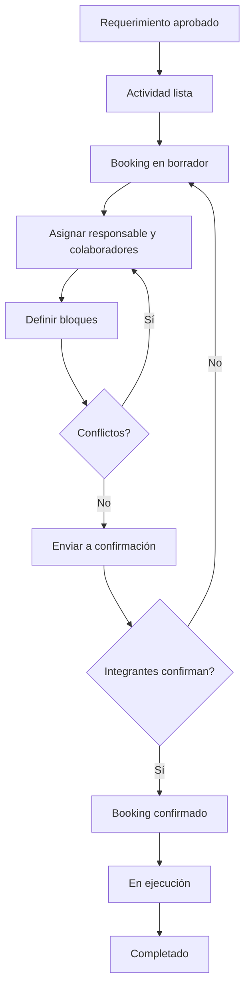

El MVP implementa el recorrido hasta confirmación en backend. Ejecución, finalización y replanificación requieren completar endpoints.

## 7. Acceso

### 7.1 Pantalla de inicio de sesión

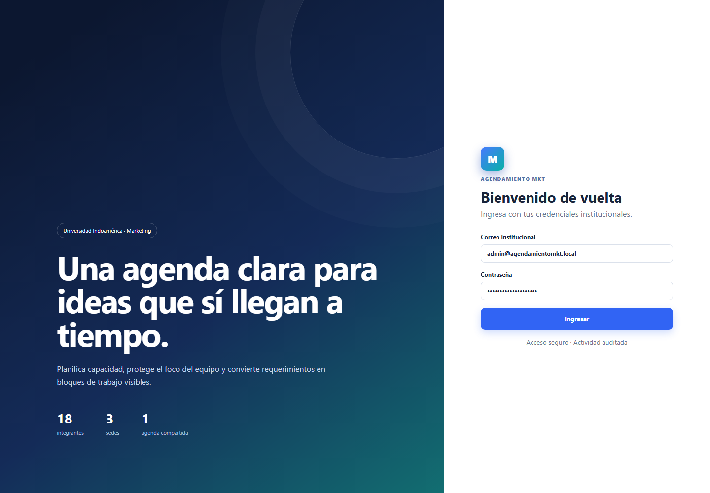

**Objetivo:** autenticar al usuario y cargar roles/permisos.

| Campo | Obligatorio | Regla |
|---|:---:|---|
| Correo institucional | Sí | Debe corresponder a usuario activo. |
| Contraseña | Sí | Se valida contra hash seguro. |

**Acción `Ingresar`:** si las credenciales son correctas, crea sesión y dirige al Dashboard. Si son incorrectas, muestra un mensaje sin indicar cuál dato falló.

**Seguridad:** no se muestran contraseñas predeterminadas. La actividad autenticada queda asociada al usuario.

## 8. Estructura general de pantallas

Todas las pantallas internas comparten:

- Marca Marketing/Booking.
- Menú lateral parametrizado.
- Resaltado de la opción actual.
- Título, descripción y acción principal.
- Perfil y rol activo.
- Diseño responsive.

El menú no es fijo: la API devuelve únicamente opciones cuyo `RequiredPermission` esté incluido en el token.

## 9. Dashboard

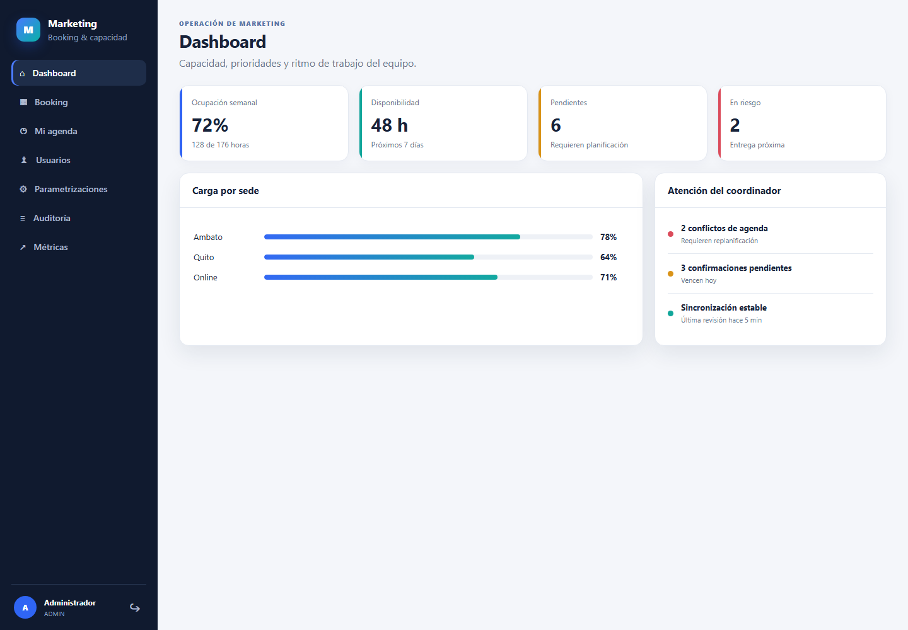

**Objetivo:** ofrecer una lectura ejecutiva de capacidad y riesgos.

### Indicadores

- Ocupación semanal.
- Horas disponibles.
- Solicitudes pendientes de planificación.
- Actividades en riesgo.
- Carga por sede.
- Conflictos, confirmaciones y sincronización.

**Importante:** los valores actuales son demostrativos en el frontend. La fase analítica debe conectarlos a datos reales.

### Uso esperado

1. Revisar alertas al iniciar jornada.
2. Identificar sedes sobrecargadas.
3. Priorizar confirmaciones y conflictos.
4. Navegar a Booking para actuar.

## 10. Booking

### 10.1 Listado

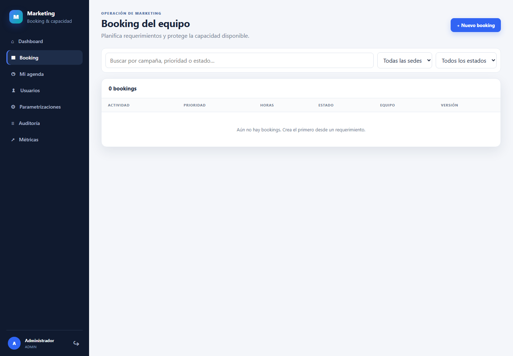

**Objetivo:** consultar la cartera de planificación.

Columnas:

- Actividad e identificador.
- Prioridad.
- Horas estimadas.
- Estado.
- Número de integrantes.
- Versión.

Filtros visuales:

- Texto libre.
- Sede.
- Estado.

Los controles de filtros están preparados visualmente; debe completarse su aplicación sobre consultas API.

### 10.2 Nuevo booking

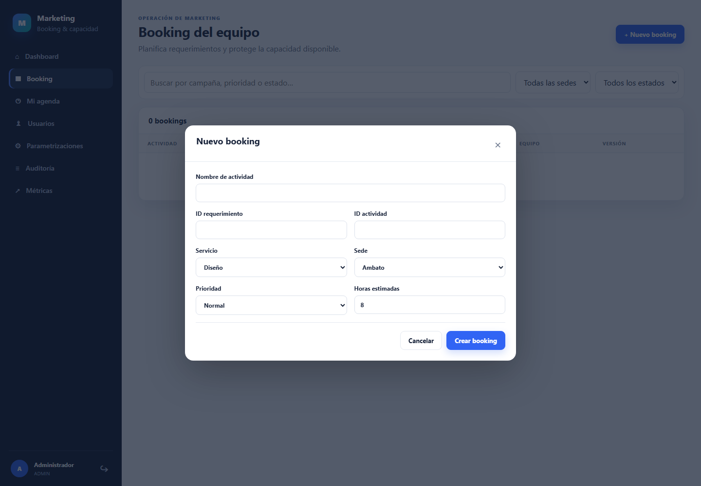

| Campo | Obligatorio | Descripción |
|---|:---:|---|
| Nombre de actividad | Sí | Nombre visible del trabajo. |
| ID requerimiento | Sí | UUID del sistema origen. |
| ID actividad | Sí | UUID único de la actividad. |
| Servicio | Sí | Diseño, Video, Fotografía, Redes o Eventos. |
| Sede | Sí | Sede coordinadora. |
| Prioridad | Sí | Normal, High o Urgent en el MVP. |
| Horas estimadas | Sí | Número mayor a cero. |

**Guardar:** crea el booking en estado `Draft`. La actividad duplicada es rechazada por índice único.

### 10.3 Maestro–detalle previsto

El detalle completo debe presentar:

- Cabecera del booking.
- Responsables y colaboradores.
- Bloques por persona.
- Confirmaciones.
- Historial y versiones.
- Integraciones externas.

Los endpoints de asignación y bloques ya existen; falta completar su interfaz visual.

## 11. Mi agenda

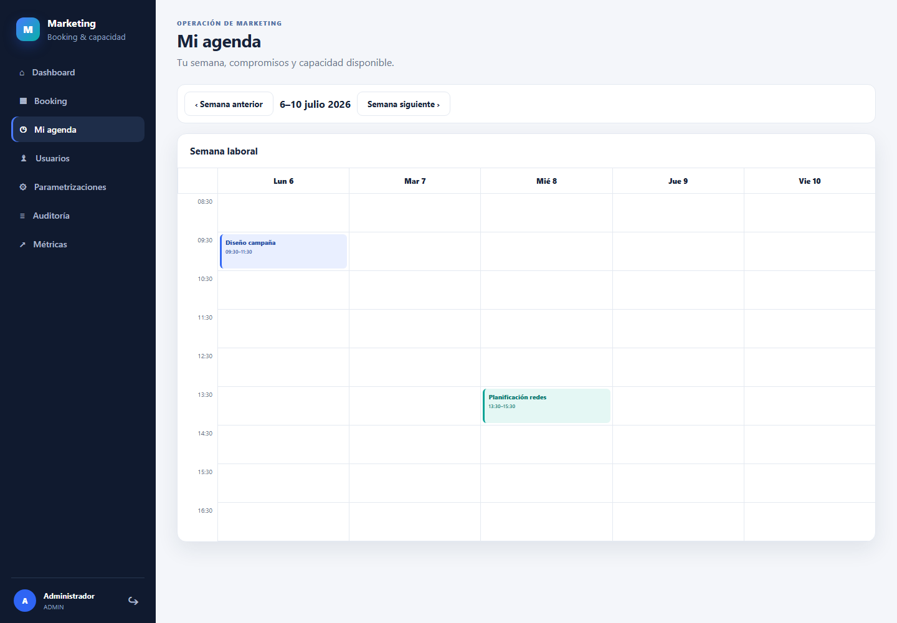

**Objetivo:** mostrar la semana laboral individual.

- Columnas: lunes a viernes.
- Filas: franjas desde 08:30.
- Tarjetas: servicio, actividad y rango.
- Navegación: semana anterior/siguiente.

La vista actual es representativa. Debe conectarse a asignaciones del usuario y luego incorporar drag-and-drop controlado.

### Regla futura de drag-and-drop

Mover un bloque confirmado no debe aplicarlo inmediatamente: debe crear una solicitud de replanificación y conservar la reserva vigente hasta aprobación conjunta.

## 12. Usuarios

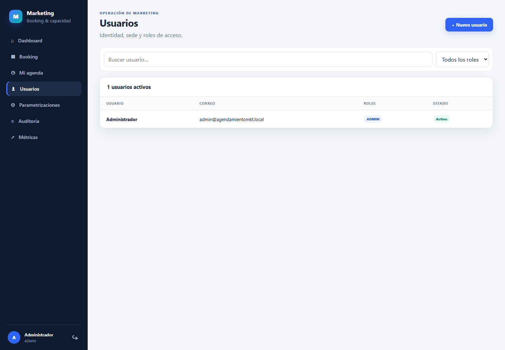

**Objetivo:** administrar identidad operativa.

Listado:

- Nombre.
- Correo.
- Roles.
- Estado.

Alta de usuario:

- Nombre completo.
- Correo único.
- Contraseña inicial.
- Sede.
- Rol.

La contraseña nunca se retorna en consultas. Los usuarios inactivos no pueden iniciar sesión.

## 13. Centro de configuración

El Centro de configuración reúne todas las parametrizaciones en una pantalla con resumen, buscador y pestañas.

### 13.1 Operación

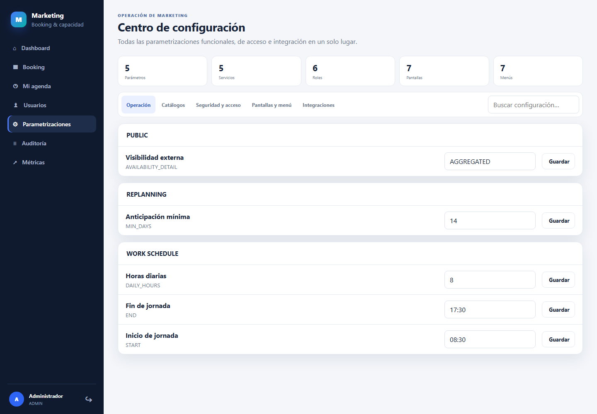

Parámetros iniciales:

| Grupo | Clave | Valor inicial | Uso |
|---|---|---:|---|
| PUBLIC | AVAILABILITY_DETAIL | AGGREGATED | Visibilidad externa. |
| REPLANNING | MIN_DAYS | 14 | Anticipación mínima. |
| WORK_SCHEDULE | DAILY_HOURS | 8 | Capacidad diaria. |
| WORK_SCHEDULE | START | 08:30 | Inicio jornada. |
| WORK_SCHEDULE | END | 17:30 | Fin jornada. |

**Guardar:** actualiza el parámetro y registra `PARAMETER_UPDATED` en auditoría.

### 13.2 Catálogos

Presenta sedes y servicios activos. En el MVP son consulta; la administración CRUD debe añadirse con validación de referencias existentes.

### 13.3 Seguridad y acceso

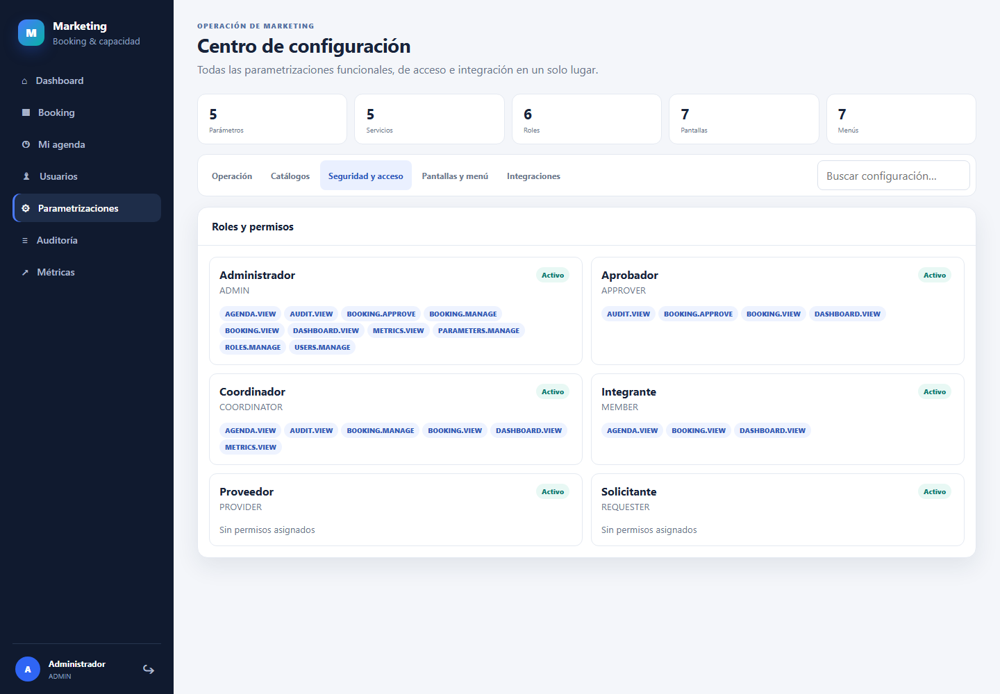

Muestra:

- Rol.
- Código.
- Estado.
- Permisos asociados.

La asignación de permisos debe mantener el principio de mínimo privilegio. El MVP muestra la configuración; la edición granular es posterior.

### 13.4 Pantallas y menú

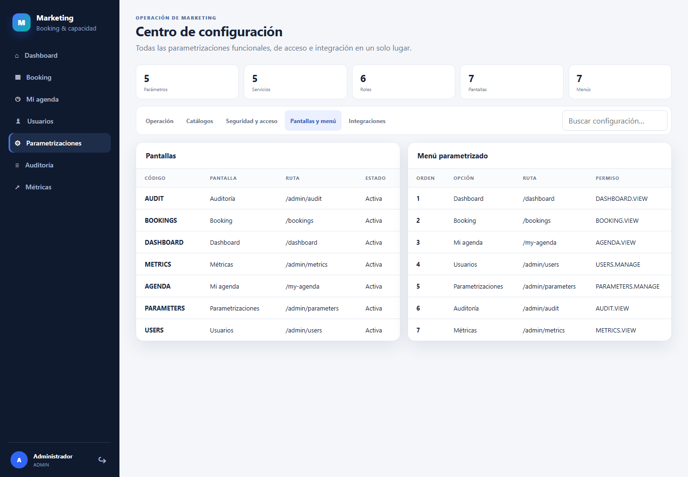

**Pantallas:** código, nombre, ruta y estado.  
**Menú:** orden, etiqueta, ruta y permiso requerido.

Una opción solo aparece si:

1. Está activa.
2. Su ruta existe.
3. El usuario tiene el permiso requerido.

### 13.5 Integraciones

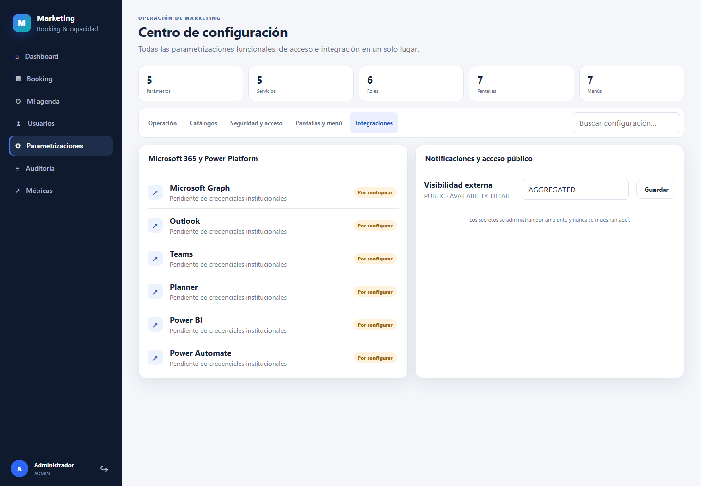

Incluye estado de:

- Microsoft Graph.
- Outlook.
- Teams.
- Planner.
- Power BI.
- Power Automate.

Los secretos no aparecen en pantalla. Se administran cifrados por ambiente. La etiqueta “Por configurar” representa correctamente el estado actual.

## 14. Auditoría

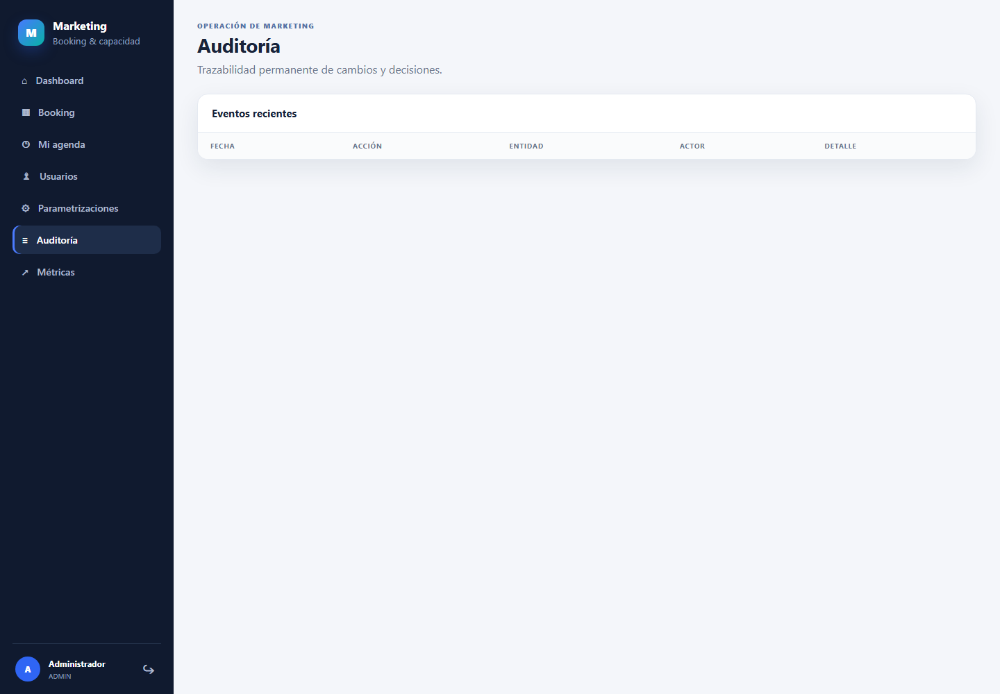

**Objetivo:** reconstruir quién hizo qué y cuándo.

Columnas:

- Fecha/hora.
- Acción.
- Entidad.
- Actor.
- Detalle JSON resumido.

Eventos actuales:

- `USER_CREATED`.
- `BOOKING_CREATED`.
- `ASSIGNMENT_ADDED`.
- `TIME_BLOCK_ADDED`.
- `BOOKING_SUBMITTED`.
- `ASSIGNMENT_CONFIRMATION`.
- `PARAMETER_UPDATED`.

La auditoría es de consulta y no debe modificarse desde la interfaz.

## 15. Métricas de usabilidad

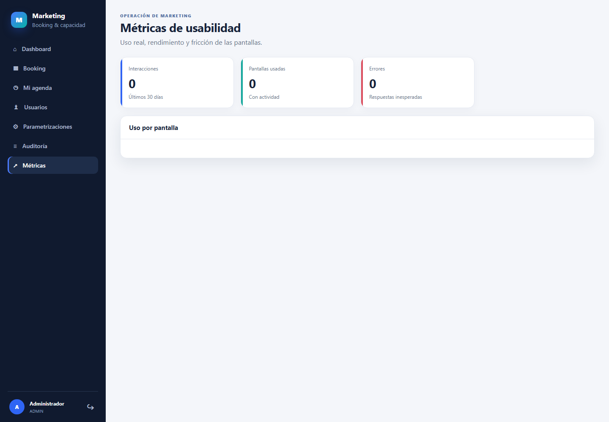

**Objetivo:** detectar uso, rendimiento y errores por ruta/pantalla.

Indicadores:

- Interacciones del periodo.
- Número de pantallas/rutas utilizadas.
- Errores detectados.
- Distribución de uso.
- Duración media en API.

No se deben usar estas métricas como medida aislada de productividad personal.

## 16. Disponibilidad pública

El endpoint público recibe sede, servicio y rango de fechas. Reglas actuales:

- Sede y servicio obligatorios.
- Fecha final mayor o igual a inicial.
- Máximo 62 días.
- Excluye fines de semana.
- No expone nombres, eventos ni porcentajes individuales.

Pendiente: calcular `Available`, `Limited` o `Unavailable` desde capacidad real.

## 17. Mensajes y validaciones

| Situación | Respuesta esperada |
|---|---|
| Credenciales incorrectas | Mensaje genérico y permanencia en login. |
| Sin permiso | 403 y sin opción de menú. |
| Booking inexistente | 404. |
| Correo duplicado | Conflicto. |
| Actividad duplicada | Conflicto. |
| Persona repetida | Conflicto. |
| Bloque solapado | Conflicto y replanificación. |
| Horario fuera de jornada | Rechazo. |
| Error inesperado | Mensaje seguro y traceId. |

## 18. Procedimientos por rol

### Coordinador — planificar

1. Abrir Booking.
2. Crear booking desde IDs del requerimiento/actividad.
3. Agregar responsable principal.
4. Agregar colaboradores.
5. Definir bloques individuales.
6. Resolver conflictos.
7. Enviar a confirmación.
8. Dar seguimiento a respuestas.

### Integrante — confirmar

1. Abrir Mi agenda o notificación futura.
2. Revisar actividad, horas y bloques.
3. Confirmar si puede cumplir.
4. Rechazar con comentario si existe conflicto.

### Administrador — parametrizar

1. Abrir Parametrizaciones.
2. Buscar clave o seleccionar pestaña.
3. Modificar únicamente valores autorizados.
4. Guardar.
5. Verificar confirmación y auditoría.

### Administrador — crear usuario

1. Abrir Usuarios.
2. Seleccionar “Nuevo usuario”.
3. Completar identidad, sede y rol.
4. Establecer contraseña inicial segura.
5. Guardar y entregar credenciales por canal protegido.

## 19. Criterios de aceptación funcional

- Un usuario sin permiso no ve menú ni ejecuta endpoint protegido.
- Un booking no se envía sin responsable y bloque.
- No se permite solapamiento de persona.
- Los parámetros se actualizan y auditan.
- Menú, roles, pantallas, sedes y servicios aparecen en el centro de configuración.
- Los secretos nunca aparecen en UI, repositorio o captura.
- Login, dashboard, booking, agenda y administración funcionan en móvil.
- Los externos no obtienen información personal.

## 20. Glosario

| Término | Definición |
|---|---|
| Capacidad | Horas laborables disponibles. |
| Ocupación | Proporción de capacidad reservada. |
| Booking | Plan de reserva asociado a una actividad. |
| Bloque | Rango horario reservado a una persona. |
| Responsable | Dueño principal de ejecución. |
| Colaborador | Participante adicional. |
| Replanificación | Propuesta de cambio sobre una reserva vigente. |
| Policy | Regla técnica que exige un permiso. |
| Parametrización | Valor modificable sin despliegue de código. |

## 21. Referencias

- [Manual técnico](../technical/technical-manual.md)
- [Arquitectura integral](../architecture/arquitectura-modulo-booking-marketing.md)
- [Secretos cifrados](../operations/encrypted-secrets.md)

