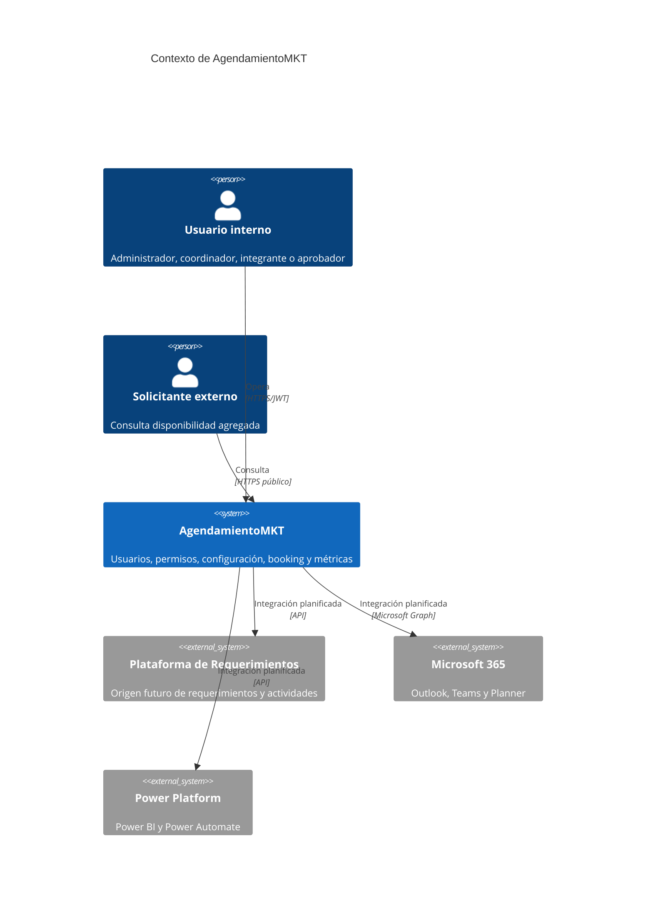
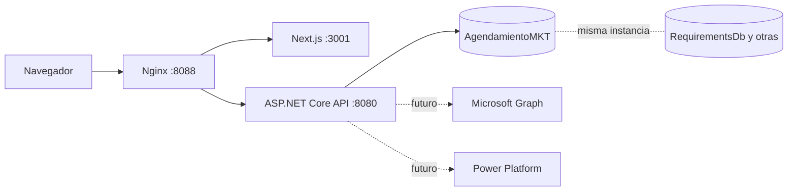
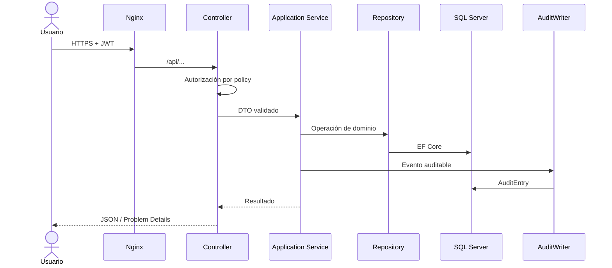
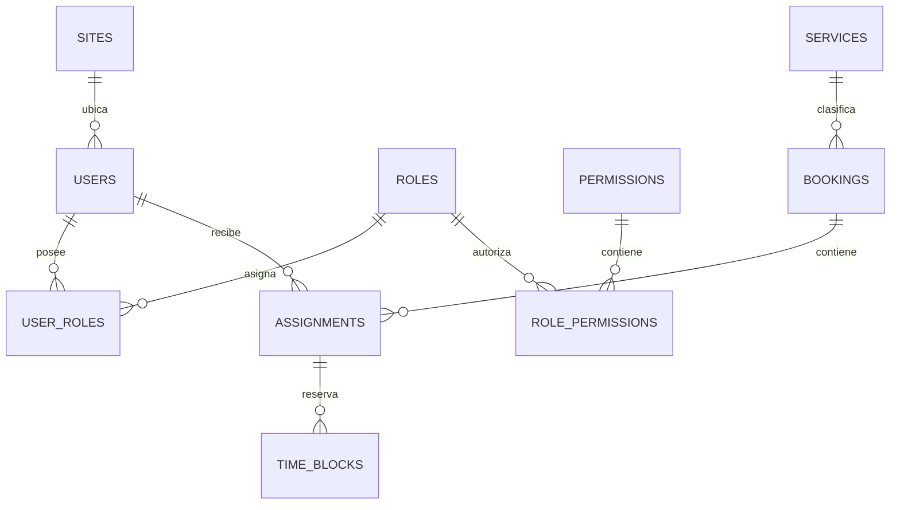
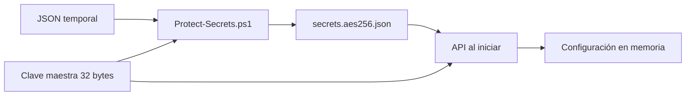

# Manual técnico — AgendamientoMKT

**Versión documentada:** rama `dev`  
**Fecha:** 3 de julio de 2026  
**Estado:** MVP ejecutable  
**Audiencia:** desarrollo, arquitectura, seguridad, infraestructura, QA y soporte

## 1. Objetivo técnico

AgendamientoMKT es un módulo web integrado conceptualmente con la Plataforma de Requerimientos de Marketing. Su propósito técnico es administrar identidad local, autorización granular, configuración operativa, bookings, asignaciones y bloques horarios sobre una única base de datos propia, reutilizando la instancia SQL Server ya operada por la plataforma existente.

El sistema se entrega como:

- API REST en .NET 10 y ASP.NET Core.
- Aplicación web en Next.js 16, React 19 y TypeScript.
- Persistencia mediante EF Core 10 y SQL Server 2022.
- Reverse proxy Nginx.
- Orquestación local con Docker Compose.
- Automatización de validación y despliegue con GitHub Actions.

## 2. Alcance implementado

| Capacidad | Estado | Observación |
|---|---|---|
| Login local JWT | Implementado | Contraseña con `PasswordHasher<AppUser>`. |
| Usuarios y roles | Implementado | Alta de usuario y consulta de roles. |
| Permisos por endpoint/pantalla | Implementado | Policies basadas en claims. |
| Menú parametrizado | Implementado | Se construye desde base y permisos. |
| Centro de configuración | Implementado | Parámetros, sedes, servicios, roles, pantallas, menú e integraciones. |
| Booking | Implementado parcialmente | Alta, asignación, bloques, envío y confirmación. |
| Conflictos horarios | Implementado | Detecta solapamiento de bloques. |
| Jornada laboral | Implementado | Lunes a viernes, 08:30–17:30. |
| Auditoría | Implementado | Registra operaciones funcionales. |
| Versiones temporales | Implementado | Tablas temporales de booking. |
| Métricas de uso | Implementado | Middleware registra llamadas API. |
| Cifrado de secretos | Implementado | AES-256-GCM, clave externa. |
| Outlook/Teams/Planner | Diseñado, pendiente | Aún no hay llamadas a Microsoft Graph. |
| Power BI/Power Automate | Diseñado, pendiente | La pantalla muestra estado por configurar. |
| Replanificación con doble aprobación | Dominio diseñado, pendiente de API | No debe considerarse productivo todavía. |
| Disponibilidad pública real | Parcial | El endpoint valida rango, pero todavía responde disponibilidad base. |

## 3. Arquitectura

### 3.1 Vista de contexto



### 3.2 Vista de contenedores



### 3.3 Monolito modular y Clean Architecture

El backend es un único ejecutable y un único `.csproj`. La separación se realiza por carpetas, namespaces, abstracciones y dirección de dependencias:

```text
AgendamientoMKT.Api/
├── Api/                 Controladores y middleware HTTP
├── Application/         Casos de uso, contratos e interfaces
├── Domain/              Entidades, invariantes y estados
├── Infrastructure/      EF Core, repositorios, cifrado y acceso externo
├── Program.cs           Composición y pipeline
└── appsettings*.json    Configuración no sensible
```

Reglas:

1. Los controladores no consultan `DbContext` ni implementan reglas de negocio.
2. Los servicios de aplicación coordinan casos de uso.
3. Las entidades protegen invariantes propias.
4. Los repositorios abstraen persistencia.
5. EF Core y SQL Server permanecen en Infrastructure.
6. Las integraciones futuras se implementarán como adaptadores de interfaces de Application.

### 3.4 Flujo de una petición



## 4. Stack y versiones

| Elemento | Versión/línea | Uso |
|---|---|---|
| .NET | 10 | Runtime y SDK. |
| ASP.NET Core | 10 | API, autenticación, autorización y middleware. |
| EF Core | 10.0.6 | ORM y tablas temporales. |
| SQL Server | 2022 | Instancia compartida `requirements-sqlserver`. |
| Next.js | 16.2.10 | App Router y salida standalone. |
| React | 19.2.7 | Interfaz. |
| TypeScript | 5.9 | Tipado estricto. |
| Node.js | 24 | Build/ejecución frontend. |
| pnpm | 11.7 | Dependencias reproducibles. |
| Nginx | 1.27 Alpine | Reverse proxy. |
| Docker Compose | Compose Specification | Entorno local. |
| xUnit v3 | 3.1 | Pruebas unitarias. |

Las versiones exactas se encuentran en los archivos de proyecto y lockfile; esos archivos son la fuente de verdad.

## 5. Modelo de datos

### 5.1 Base e instancia

- Contenedor existente: `requirements-sqlserver`.
- Puerto externo local: `14333`.
- Red Docker: `requirements-platform_default`.
- Base del módulo: `AgendamientoMKT`.
- Nivel de compatibilidad: 160.
- `READ_COMMITTED_SNAPSHOT`: habilitado.

El módulo usa una sola base. Comparte instancia con otras bases, pero no mezcla tablas ni migraciones con `RequirementsDb`.

### 5.2 Esquemas

| Esquema | Tablas | Propósito |
|---|---|---|
| `identity` | Users, Roles, Permissions, UserRoles, RolePermissions | Identidad y autorización. |
| `catalog` | Sites, Services, Screens, MenuItems, Parameters | Maestros y configuración. |
| `booking` | Bookings, Assignments, TimeBlocks y sus historiales | Planificación. |
| `audit` | AuditEntries, UsageMetrics | Trazabilidad y observabilidad funcional. |

### 5.3 Relaciones principales



### 5.4 Tablas temporales

`Bookings`, `Assignments` y `TimeBlocks` usan system-versioned temporal tables. SQL Server conserva el estado anterior en tablas históricas administradas por el motor. Esto complementa, no reemplaza, `AuditEntries`:

- Temporal: permite reconstruir valores.
- Auditoría funcional: conserva actor, acción y contexto JSON.

## 6. Dominio y reglas

### 6.1 Booking

Campos centrales:

- `RequirementId` y `ActivityId`: trazabilidad con el sistema origen.
- `ServiceId` y `SiteId`: clasificación.
- `Title`, `Priority`, `EstimatedHours`.
- `Status` y `Version`.
- Colección de asignaciones.

Estados definidos:

```text
Draft → PendingConfirmation → Confirmed → InProgress → Completed
                         ↘ ReplanningRequested
Draft/Confirmed → Cancelled
```

En el MVP, las transiciones implementadas son creación en `Draft`, envío a `PendingConfirmation` y confirmación individual. Las demás requieren completar casos de uso.

### 6.2 Invariantes implementadas

- Requerimiento, actividad, servicio y sede son obligatorios.
- Horas estimadas y asignadas deben ser mayores a cero.
- Una persona no puede repetirse en un mismo booking.
- Un booking enviado debe tener responsable principal.
- Debe existir al menos un bloque horario.
- Un bloque termina después de iniciar.
- El bloque pertenece a un único día laborable.
- No se permiten sábados ni domingos.
- Horario válido: 08:30–17:30.
- Se rechazan solapamientos para una misma persona.
- Solo se editan responsables/bloques cuando está en borrador.

## 7. Seguridad

### 7.1 Autenticación

- Endpoint: `POST /api/auth/login`.
- Contraseñas almacenadas con `PasswordHasher<AppUser>`.
- Token JWT firmado con HMAC SHA-256.
- Emisor y audiencia validados.
- Vigencia predeterminada: 480 minutos.
- Desviación de reloj máxima: un minuto.

### 7.2 Autorización

Los permisos se incluyen como claims `permission`. Cada endpoint sensible exige una policy específica.

| Policy | Finalidad |
|---|---|
| `DASHBOARD.VIEW` | Dashboard. |
| `BOOKING.VIEW` | Consultar booking. |
| `BOOKING.MANAGE` | Crear y planificar. |
| `BOOKING.APPROVE` | Aprobaciones futuras. |
| `AGENDA.VIEW` | Agenda personal. |
| `USERS.MANAGE` | Administración de usuarios. |
| `ROLES.MANAGE` | Roles/permisos. |
| `PARAMETERS.MANAGE` | Centro de configuración. |
| `AUDIT.VIEW` | Auditoría. |
| `METRICS.VIEW` | Métricas. |

### 7.3 Secretos AES-256-GCM



El sobre cifrado contiene `version`, `algorithm`, `nonce`, `tag` y `ciphertext`. La clave maestra:

- Se entrega mediante `AGENDAMIENTO_MASTER_KEY`.
- No se guarda en Git ni en la imagen.
- Debe ser distinta por ambiente.
- Debe almacenarse en GitHub Environment Secret o gestor equivalente.

La API no inicia si el archivo es obligatorio y falta, la clave no tiene 256 bits o la autenticación GCM falla.

### 7.4 Controles adicionales

- Archivo cifrado montado read-only.
- `.dockerignore` evita incorporarlo a imágenes.
- `.gitignore` excluye archivo cifrado local, claro temporal y `.env`.
- Errores 500 no exponen excepciones internas.
- Parámetros EF Core evitan concatenación SQL.
- Consulta pública no retorna nombres ni agendas personales.

## 8. API REST

### 8.1 Autenticación

| Método | Ruta | Acceso | Resultado |
|---|---|---|---|
| POST | `/api/auth/login` | Público | JWT, expiración y perfil. |

### 8.2 Booking

| Método | Ruta | Policy | Función |
|---|---|---|---|
| GET | `/api/bookings` | BOOKING.VIEW | Lista bookings. |
| GET | `/api/bookings/{id}` | BOOKING.VIEW | Maestro–detalle. |
| POST | `/api/bookings` | BOOKING.MANAGE | Crea borrador. |
| POST | `/api/bookings/{id}/assignments` | BOOKING.MANAGE | Agrega responsable/colaborador. |
| POST | `/api/bookings/{id}/assignments/{assignmentId}/blocks` | BOOKING.MANAGE | Reserva bloque. |
| POST | `/api/bookings/{id}/submit` | BOOKING.MANAGE | Envía a confirmación. |
| POST | `/api/bookings/{id}/assignments/{assignmentId}/confirm` | BOOKING.VIEW | Confirma/rechaza asignación. |

### 8.3 Administración

| Método | Ruta | Policy | Función |
|---|---|---|---|
| GET | `/api/administration/lookups` | Autenticado | Roles, sedes y servicios. |
| GET | `/api/administration/menu` | Autenticado | Menú filtrado por permisos. |
| GET | `/api/administration/users` | USERS.MANAGE | Usuarios. |
| POST | `/api/administration/users` | USERS.MANAGE | Alta de usuario. |
| GET | `/api/administration/parameters` | PARAMETERS.MANAGE | Parámetros. |
| GET | `/api/administration/configuration-center` | PARAMETERS.MANAGE | Configuración consolidada. |
| PUT | `/api/administration/parameters/{id}` | PARAMETERS.MANAGE | Modifica valor. |
| GET | `/api/administration/audit` | AUDIT.VIEW | Últimos eventos. |
| GET | `/api/administration/metrics` | METRICS.VIEW | Resumen por pantalla/ruta. |

### 8.4 Público y salud

| Método | Ruta | Acceso | Función |
|---|---|---|---|
| GET | `/api/public/availability` | Público | Disponibilidad agregada por sede/servicio. |
| GET | `/health` | Público técnico | Salud del proceso. |

### 8.5 Errores

El middleware devuelve `application/problem+json`:

- 400: argumentos inválidos.
- 404: entidad inexistente.
- 409: conflicto de estado o agenda.
- 500: error no controlado, con `traceId`.

## 9. Frontend

### 9.1 Estructura

```text
AgendamientoMKT.Web/
├── app/
│   ├── admin/{users,parameters,audit,metrics}
│   ├── bookings
│   ├── dashboard
│   ├── my-agenda
│   ├── components.tsx
│   └── globals.css
├── lib/api.ts
└── next.config.ts
```

### 9.2 Sesión

El MVP conserva el JWT en `localStorage` bajo `mkt-session`. Para producción se recomienda migrar a cookie `HttpOnly`, `Secure` y `SameSite` administrada por un backend-for-frontend, reduciendo exposición ante XSS.

### 9.3 Responsive

- Escritorio: sidebar fijo y área de trabajo.
- Tablet: sidebar compacto.
- Móvil: navegación inferior, grids de una columna y tablas desplazables.

## 10. Docker y operación local

### 10.1 Servicios

| Servicio | Puerto host | Función |
|---|---:|---|
| `api` | 5200 | API directa/Swagger. |
| `web` | 3001 | Next.js directo. |
| `nginx` | 8088 | Entrada recomendada. |
| `sqlserver-init` | — | Perfil opcional `bootstrap`. |

SQL Server se administra desde `requirements-platform`.

### 10.2 Primer arranque

```powershell
.\scripts\Initialize-LocalSecrets.ps1
docker compose up -d --build
docker compose ps
```

El script solicita la contraseña inicial de manera segura, genera claves aleatorias, cifra la configuración, elimina el JSON claro y crea `.env` ignorado.

### 10.3 Comandos

```powershell
docker compose logs -f api
docker compose restart api
docker compose down
```

No ejecutar `down -v` sobre la plataforma de requerimientos sin un respaldo autorizado.

## 11. CI/CD

### 11.1 Ramas y ambientes

| Rama | Environment | Uso |
|---|---|---|
| `dev` | development | Integración continua. |
| `test` | testing | Validación funcional. |
| `prod` | production | Producción. |

### 11.2 Pipeline de calidad

- Restauración y compilación .NET 10.
- Ejecución de pruebas.
- Node.js 24 y pnpm.
- ESLint sin advertencias.
- TypeScript `--noEmit`.
- Build Next.js.
- Validación de Docker Compose.

### 11.3 Despliegue

El workflow selecciona el ambiente desde la rama, usa concurrencia por ambiente y despliega por SSH cuando `DEPLOY_ENABLED=true`. Producción debe exigir aprobación manual y rama protegida.

## 12. Pruebas y calidad

### 12.1 Estado actual

- 7 pruebas unitarias.
- Compilación con `TreatWarningsAsErrors`.
- Análisis recomendado de .NET.
- TypeScript estricto.
- ESLint con cero advertencias.
- Lockfile pnpm sujeto a políticas de cadena de suministro.

### 12.2 Cobertura actual

- Responsable obligatorio.
- Transición a confirmación.
- Jornada laboral.
- Rango de bloque inválido.
- Round-trip AES-256-GCM.
- Rechazo de sobre cifrado alterado.

### 12.3 Pendientes de calidad

- Pruebas de integración con SQL Server real.
- Pruebas de autorización por policy.
- Pruebas E2E de navegador.
- Pruebas de carga de calendarios.
- Umbral de cobertura en CI.
- Escaneo SAST, dependencias e imágenes.

## 13. Auditoría y métricas

`AuditWriter` registra actor, acción, entidad, identificador, fecha UTC y JSON contextual. `UsageTrackingMiddleware` mide ruta API, método, duración y estado HTTP.

No deben enviarse a métricas:

- Contraseñas.
- Tokens.
- Contenido de secretos.
- Detalles privados de calendario.
- Datos personales innecesarios.

## 14. Observabilidad y soporte

### Diagnóstico básico

1. `docker ps` para estado de contenedores.
2. `/health` para proceso API.
3. `docker logs agendamiento-mkt-api` para errores.
4. Verificar red `requirements-platform_default`.
5. Verificar archivo cifrado y clave maestra.
6. Consultar `audit.AuditEntries` para acción funcional.

### Fallos comunes

| Síntoma | Causa probable | Acción |
|---|---|---|
| API no inicia | Falta archivo/clave cifrada | Regenerar secretos y revisar montaje. |
| Login 401 | Credenciales o usuario inactivo | Revisar usuario y hash. |
| 403 | Falta policy | Revisar rol y RolePermissions. |
| 409 al reservar | Solapamiento o estado inválido | Replanificar bloque. |
| Menú incompleto | Permisos insuficientes | Revisar RequiredPermission. |
| Error SQL | Contenedor/red/credenciales | Validar `requirements-sqlserver`. |

## 15. Evolución recomendada

1. Sustituir `EnsureCreated` por migraciones EF Core versionadas antes de producción.
2. Implementar integración de requerimientos por API/eventos.
3. Completar replanificación y doble aprobación.
4. Incorporar Microsoft Graph con outbox, webhooks e idempotencia.
5. Publicar modelo analítico para Power BI.
6. Migrar JWT del navegador a cookie HttpOnly/BFF.
7. Incorporar almacenamiento central de secretos en producción, manteniendo AES-256-GCM para exportaciones/configuración offline.
8. Añadir OpenTelemetry y panel de salud de integraciones.

## 16. Referencias internas

- [Arquitectura integral](../architecture/arquitectura-modulo-booking-marketing.md)
- [Stack y estructura backend](../architecture/technology-stack.md)
- [Secretos cifrados](../operations/encrypted-secrets.md)
- [Despliegues automáticos](../operations/automatic-deployments.md)
- [Manual funcional](../functional/functional-manual.md)

